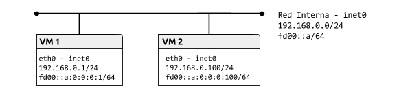

# Práctica 2.4.Tuberías

## Tabla de contenido
- [Llamadas del API para la gestión de direcciones](#llamadas-del-api-para-la-gestión-de-direcciones).
- [Protocolo UDP Servidor de hora](#protocolo-udp-servidor-de-hora).
  1. Servidor UDP de fecha y hora
  2. Cliente UDP
  3. Servidor UDP de fecha y hora multiplexado
  4. Servidor UDP multiproceso (opcional)
- [Protocolo TCP Servidor de echo](#protocolo-tcp-servidor-de-echo).
  1. Servidor TCP echo
  2. Cliente TCP
  3. Servidor TCP multiproceso
  4. Servidor TCP multiproceso con finalizacion

### Topología


## Preparación del entorno para la práctica


(No es neccesario para el primer apartado).

*VM1*
```bash
$ip link set eth0 up
$ip a add 192.168.0.1/24 dev eth0
$ip a add fd00::a:0:0:0:1/64 dev eth0
```

*VM2*
```bash
$ip link set eth0 up
$ip a add 192.168.0.100/24 dev eth0
$ip a add fd00::a:0:0:0:100/64 dev eth0
```


## Llamadas del API para la gestión de direcciones

### Ejercicio 1

Solución completa: [Llamadas API](Llamadas_del_api_para_la_gestion_de_direcciones/ej1.c)


## Protocolo UDP Servidor de hora


### Ejercicio 1: servidor UDP de fecha y hora

1.- Obtenemos el código del servidor del man (forma rápida)
```bash
$ man 3 getaddrinfo > udptimeserver.c
$ gedit udptimeserver.c
```
Y nos quedamos con el código de ejemplo de servidor UDP.

2.- Para que funcione con IPv6, sustituimos el NULL por "::" en el primer parametro de la llamada a getaddrinfo();

```c
s = getaddrinfo("::", argv[1], &hints, &result);
```

3.- Metemos   #include <time.h>

4.- Dentro del for(;;), obtenemos la variable del tiempo:

```c
time_t raw;
struct tm *tm;
time(&raw);
tm = localtime(&raw);
```

4.- Escribimos las condiciones para el comportamiento del servidor

```c
if(nread==2)
  if(buf[0]=='t') nread = strftime(buf,BUF_SIZE,"%I:%M:%S\n", tm);
  else if(buf[0]=='d')nread = strftime(buf,BUF_SIZE,"%x\n", tm);
  else if(buf[0]=='q')exit(0);
buf[nread]='\0';//Limpiar el buffer
```      

Solución completa: [Servidor UDP Hora](Protocolo_UDP_Servidor_de_hora/ej1.c)

### Ejercicio 2: cliente UDP

Nos basta simplemente con el ejemplo del man

```bash
$ man 3 getaddrinfo > udpclient.c
$ gedit udpclient.c
```
Y nos quedamos con el código de ejemplo de cliente UDP.

Solución completa: [Cliente UDP](Protocolo_UDP_Servidor_de_hora/ej2.c)

### Ejercicio 3: multiplexación
1.- Partimos del servidor UDP de fecha y hora.

2.- Creamos los descriptores de fichero dentro del for(;;)

```c
fd_set fset;
FD_ZERO(&fset);
FD_SET(0,&fset);
FD_SET(sfd, &fset);
```

3.- A continuación hacemos la llamada a select

```c
s = select(sfd+1, &fset, NULL, NULL, NULL);
if(s<=0) exit(0);//comprobación
```
*Para este ejercicio, el último parametro lo podemos dejar a NULL*

4.- Ahora podemos diferenciar entre input de consola o desde el socket:

```c
if(FD_ISSET(sfd, &fset)){
  //Codigo para procesar el socket
  //...
}else if(FD_ISSET(0,&fset)){
  //Codigo para procesar la consola
  //Lectura
  if(read(0, buf, 2) < 0) perror("Fallo al leer comando de stdin");
  //...
}
//Calcular hora / fecha / salir

//Salida por socket / consola
if(FD_ISSET(sfd, &fset)){
  if (sendto(sfd, buf, nread, 0, (struct sockaddr *) &peer_addr, peer_addr_len) != nread) fprintf(stderr, "Error sending response\n");
}else if(FD_ISSET(0,&fset)) printf("%s\n",buf);
```

Solucion completa: [UDP Multiplexado](Protocolo_UDP_Servidor_de_hora/ej3.c)

### Ejercicio 4: servidor UDP multiproceso (opcional)

Solución completa: [UDP Multiproceso](Protocolo_UDP_Servidor_de_hora/ej4.c)

## Protocolo TCP Servidor de echo

### Ejercicio 1: TCP Echo

1.- Partimos del servidor UDP del man

```bash
$ man 3 getaddrinfo > tcpserver.c
$ gedit tcpserver.c
```


2.- Para que funcione con IPv6, sustituir el NULL por "::" en el primer parametro de la llamada a getaddrinfo();

```c
s = getaddrinfo("::", argv[1], &hints, &result);
```

3.- Como queremos un socket TCP, cambiamos SOCK_DGRAM por SOCK_STREAM

4.- Antes del for(;;) metemos la llamada a listen:

```c
listen(sfd, 5);
```

5.- Vamos a construir ahora el nuevo for(;;)

  a.- Borramos todas lineas hasta la inicializacion de los chars *host* y *service*

  b.- Introducimos en su lugar la llamada a accept:

  ```c
  peer = accept(sfd, (struct sockaddr *) &peer_addr, &peer_addr_len);
  ```

  c.- Borramos todas las lineas del for(;;) que están después de la llamada a getnameinfo

  d.- Introducimos en su lugar el while que gestionará el comportamiento del servidor:

  *NOTA: se usan 80 bytes arbitrariamente en la llamada a recv()*

  ```c
  while(nread = recv(peer, buf, 80, 0)){//recibe un mensaje del socket
    buf[nread] = '\0';//limpia el buffer recibido
    printf("\tMensaje (%i bytes): %s\n", nread, buf);//lo muestra en la consola del servidor
    send(peer, buf, nread, 0);//Reenvia el mensaje integro (echo)
  }
  ```

Solución completa: [TCP Echo](Protocolo_TCP_Servidor_de_echo/ej1.c)

### Ejercicio 2: cliente TCP

1.- Para hacerlo más rápido podemos partir del ejemplo de cliente UDP del man

```bash
$ man 3 getaddrinfo > tcpclient.c
$ gedit tcpclient.c
```

2.- Cambiamos SOCK_DGRAM por SOCK_STREAM

3.- Borramos el segundo for() entero

4.- En su lugar inicializamos las siguientes variables

```c
char host[NI_MAXHOST], service[NI_MAXSERV];
ssize_t c;
```

5.- Y a continuación creamos un while que gestionará el comportamiento del cliente

```c
while(1){
  c = read(0,buf, 255);//lee de teclado
  buf[c] = '\0';//limpia el buffer
  send(sfd,buf, c, 0);//envia el mensaje al servidor

  c = recv(sfd, buf, 255, 0);//Obtiene la respuesta del servidor
  buf[c] = '\0';//limpia el buffer recibido
  printf("%s\n", buf);//Imprime por consola la respueta
}
```

Solución completa: [Cliente TCP](Protocolo_TCP_Servidor_de_echo/ej2.c)

### Ejercicio 3: TPC multiproceso

1.- Partimos del servidor TCP anterior, metemos el fork después de la llamada a accept

  ```c
	pid_t pid;
	pid = fork();
  ```

2.- Envolvemos el while y el getnameinfo dentro del if

```c
//char host[NI_MAXHOST], service[NI_MAXSERV];
if(pid==0){//Cada hijo es un nuevo cliente
  //getnameinfo
  //while
  close(peer);
} else close(peer);
```
*Para probarlo nos conectamos con dos terminales al servidor y observamos que nos responde correctamente*

Solución completa: [TCP multiproceso](Protocolo_TCP_Servidor_de_echo/ej3.c)

### Ejercicio4: TCP multiproceso sin zombies
*NOTA: para no dejar procesos zombies tenemos que trabajar con señales*
1.- Metemos

```c
#include<sys/wait.h>
```

2.- Añadimos la función
```c
void func(int sugnum){
  wait(NULL);
}
```
3.- En el proceso padre (PID!=0) añadimos el manejo del la señal SIGCHLD:

```c
signal(SIGCHLD,func);
```

4.- Al final del if(pid==0), añadimos:
```c
exit(0);
 ```
*Para comprobar si quedan procesos zombies podemos utilizar el comando:*

```bash
ps -eaf
```
*Observamos como cada vez que conectamos un cliente aparece un proceso nuevo en nuestro servidor. Si funciona bien, al cerrar un cliente se debe de matar también el proceso que lo manejaba.*

Solución completa: [TCP Finalizacion](Protocolo_TCP_Servidor_de_echo/ej4.c)
